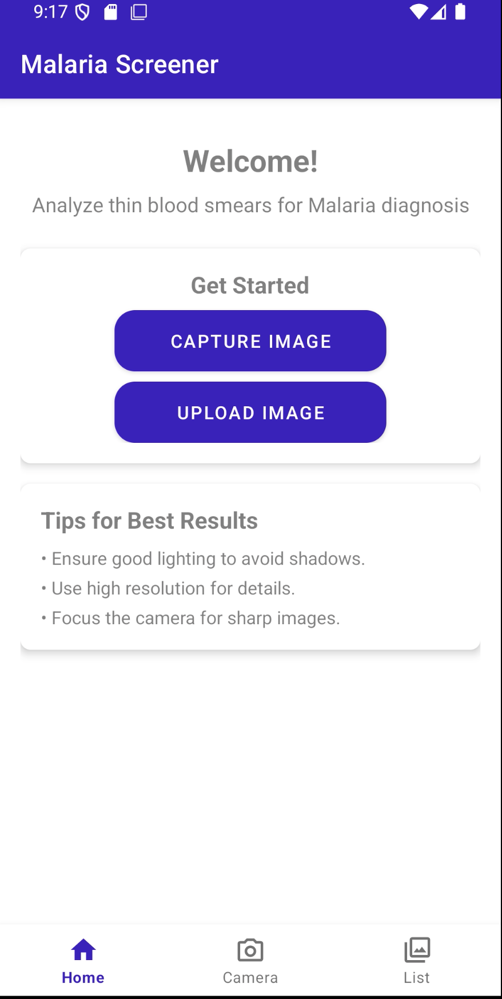
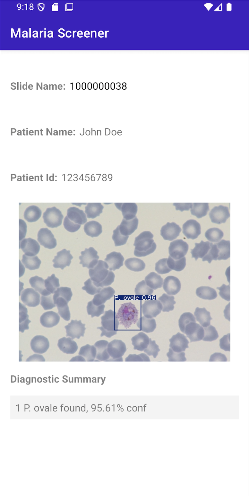

# MalariaScreener

This app is inspired by the [NIH malaria screener](https://github.com/LHNCBC/MalariaScreener), but with expanded functionality. While the NIH app focuses only on screening for Plasmodium Falciparum, this app is designed to detect six major parasites that infect humans:

- **P. falciparum**
- **P. ovale**
- **P. malariae**
- **P. vivax**
- **Babesia**
- **Trypanosoma brucei**
The type of parasite infecting the host is crucial to determine the treatment plan as symptoms depend on which parasite is involved. This screener helps differentiate between these six parasites by drawing bounding boxes around each parasite detected in thin blood smear images.

## Challenges and Future Considerations:
The original model showed very high accuracy when distinguishing between the six species.
However, when integrating the model into an Android application, the model had to be converted into a TensorFlow Lite (TFLite) format to enable mobile device compatibility. Unfortunately, this conversion process impacted the accuracy of the model, and further improvements are needed to optimize performance in a mobile setting.

## Future Work:
1. Improving the TFLite model's accuracy: ensure high-quality parasite detection on Android devices. 
2. Exploring new machine learning techniques: explore other models to improve detection performance. 
3. Extending the app's capabilities to screen for other potential pathogens.

## App in Action:

